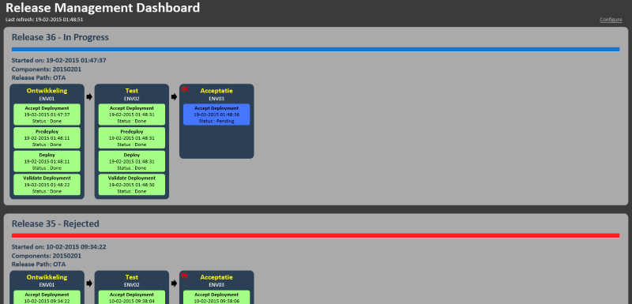
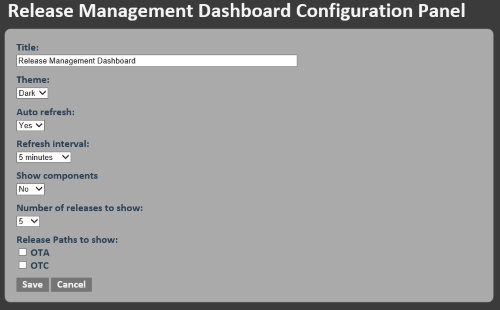

# Microsoft Release Management Dashboard
This repo contains a simple dashboard for Microsoft Release Management (RM). It's used primarily for giving teams a quick insight into their release pipeline and all releases that are triggered. 

## Dashboard
The dashboard shows the last 5 releases that were started on the RM server (the number of releases shown is configurable). See a screenshot of a dashboard below:

Per release, the stages are shown that are defined in the releasepath that was chosen when the release was started.
Also the components that are being deployed within the release are shown.
For every stage a block is shown with the name of the stage and the name of the corresponding environment. 
Within each stage block, the steps that are executed within that stage are shown. 
The stage that was chosen as target stage for the release is tagged with a bulls-eye icon in the top-left corner.
When a step is an approval step and it is not automated, the user or group that has to approve is shown.

## Approvals
By clicking on the 'Approvals' link in the upper-right corner of the dashboard, the RM website for approvers is shown. 
The URL used for this link can be configured in the Web.config using the appSetting **'UrlReleaseExplorer'**.

## Configuration Panel
By clicking the 'Configure' link in the upper-right corner of the dashboard, the configuration panel is shown: 

The following settings are available:

- **Title** : the title shown on the dashboard
- **Theme** : the color theme to use
- **Auto refresh** : indication whether or not the page is automatically refreshed
- **Refresh interval** : the interval to wait between every page refresh
- **Show components** : indication whether or not to show the components being deployed
- **Number of releases** : the number of releases to show on the dashboard
- **Release paths** : the releasepaths to show on the dashboard (none selected means no filter)

If one or more releasepaths are selected and a new releasepath is added in RM, this new releasepath is not shown on the dashboard until it is selected on the configuration panel.

The settings are persisted in a cookie on the client machine when the 'Save' button is clicked.
The cancel button will discard any configuration changes and return to the dashboard.

## Installation
The dashboard is built as an ASP.NET web-application that must be deployed to an IIS webserver.
The application consists of an HTML5/Angular SPA "front-end" and an ASP.NET WebAPI back-end. 
The WebAPI collects the necessary data by querying the RM database.
The web.config contains the connection-string to connect to the database and the URL to the RM website for approvers. 
The user used to connect to the database must have read-access to the following tables:

- Environment
- ReleaseStatus
- ReleaseStepStatus
- ReleaseV2
- ReleaseV2ActivityLog
- ReleaseV2Component
- ReleaseV2StageWorkflow
- ReleaseV2Step
- SecurityGroup
- Stage
- StageStepType
- StageType
- User

The WebAPI exposes 2 resources:

- **/api/releases** : the data that is presented on the dashboard
- **/api/releasepaths** : the list of releasepaths defined in RM (used on the configuration panel)

When doing a GET request on /api/releases, three optional headers can be included in the request:

- **includedReleasePathIds** : a comma-separated list (without spaces) of releasepath Ids to include in the dashboard
- **releaseCount** : the number of releases to show in the dashboard
- **showComponents** : indication if the released components should be displayed on the dashboard

## Compatibility
The dashboard is currently only tested with Release Management 2013 Update 4 and is only implemented for the "vNext" functionality in RM. 

